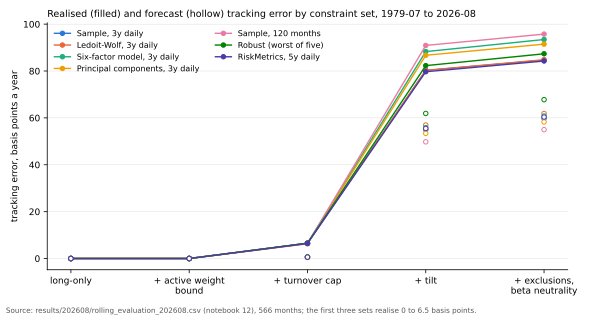
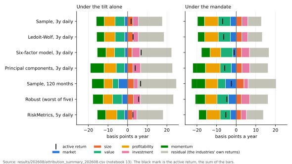

# Optimal versus naive diversification: a replication, and what a tracking-error mandate changes

I replicate DeMiguel, Garlappi and Uppal (2009), "Optimal Versus Naive Diversification: How Inefficient is the 1/N Portfolio Strategy?" (Review of Financial Studies 22(5), 1915-1953), on four of the five datasets the paper takes from Ken French's library (the fifth, FF-3-factor, has no tables in the paper), and then ask their question of a long-only index-tracking mandate: once a portfolio has to stay close to its benchmark under a weight bound, a turnover cap and an industry tilt, does the choice of covariance estimator still matter? On the paper's own sample the replication reproduces 29 of the 30 out-of-sample Sharpe ratios that carry a pre-committed band and all 30 turnover figures. The extension, on French's 49 industries from 1979 to 2026, finds that the estimator still matters under the mandate, by about a tenth of the tracking error, and that the mandate's industry tilt cost nothing detectable in return over 47 years while leaving small factor exposures of the same sign under every estimator.

## Findings

On the paper's sample (1963-07 to 2004-11, a 120-month estimation window, 377 out-of-sample months) the nine rules reproduce the paper's Tables 3 to 5. Of the 30 out-of-sample Sharpe ratios (the mean excess return divided by its standard deviation, monthly as in the paper) that carry a band of 0.03 fixed before the code ran, 29 are within it and most within 0.01. The one miss is minimum variance on the FF-4-factor dataset, 0.033 against the paper's -0.018; ten basis points of noise added to every return move the replicated figure across a range of 0.08 that does not reach the published value, so the two vintages of French's data differ there, as the in-sample rows on the size-and-value datasets also show. All 30 turnover figures are within 25% of the paper's. The unconstrained mean-variance rows carry no verdict, by a decision recorded with its evidence in `src/bp/constants.py`: under the same noise they move by 0.12 to 0.25 in Sharpe ratio with the published figure inside the range, because their weights follow a near-singular covariance. The top three rules come out in the paper's order on two of the four datasets; on the other two, the rules that change places have published Sharpe ratios 0.002 to 0.007 apart, below what a band of 0.03 can resolve. The paper's Proposition 1 reproduces in all 13 values it states and its simulation in 77 of 81 cells.

The paper's conclusion does not rest on normal returns or on independent months. With Student-t shocks the estimated rules lose 0.002 in Sharpe ratio at 5 degrees of freedom and nothing detectable at 10, because the cost of estimation sits in the means and the sampling error of a mean does not depend on the tails. With GARCH(1,1) volatility the comparison does not change, and an oracle that knows each month's covariance exactly gains 0.003 to 0.005, which bounds what any estimate of changing risk can add to a rule that only splits wealth between assets. On the 261 months since the paper (2004-12 to 2026-08) one of 32 rule-dataset cells beats 1/N at the 5% level, and minimum variance, the best optimising rule of the paper's period, falls to -0.015 and -0.034 on the two factor datasets against 0.113 and 0.148 for 1/N, because the size and value premia it loaded on fell.

The extension runs on French's 49 industry portfolios from 1979-07 to 2026-08, 566 months, against a cap-weighted benchmark built from French's own firm counts and average sizes, which tracks his market return within 47 basis points a year (gate 50, fixed before the run). The portfolio tracks the benchmark long-only, within an active weight bound of 2 percentage points per industry and a one-way turnover cap of 2% a month, under a mandate of the kind an enhanced index fund with sustainability constraints runs: Coal, Oil and Utilities held at no more than half their benchmark weight, tobacco and weapons excluded, and a beta of one to the benchmark. Each month's portfolio is the one closest to the benchmark in forecast tracking error under those rules, with no expected return anywhere in the problem, and the forecast comes from one of five covariance estimates: the sample covariance, Ledoit-Wolf shrinkage, a six-factor model and a principal-component model, each on three years of daily returns, and the sample covariance of 120 monthly returns. A sixth portfolio minimises the worst case across the five and a seventh uses an exponentially weighted covariance (RiskMetrics).

Without constraints the estimator matters, as Dom, Howard, Jansen and Lohre (2024) find for the global minimum-variance portfolio: on monthly data the minimum-variance portfolio from the sample covariance realises 14.1% volatility a year against 12.1% to 12.8% for the three structured estimators, and the long-only constraint brings every estimator to within 0.2 points of the others (12.1% to 12.3%). Under the mandate the differences shrink and do not disappear. The four daily estimators realise 84.7 (sample), 84.8 (shrinkage), 91.5 (principal components) and 93.4 (factor model) basis points a year of tracking error, the monthly covariance 95.8, the robust portfolio 87.4 and RiskMetrics 84.3: a range of 9 across the four daily estimators on a level of about 90. Every estimator under-forecasts its own tracking error, by 22% to 39% on daily data and 61% on monthly data, the robust worst-case forecast by 9%; calibrating each forecast on its own previous 60 months, with nothing from the future, brings the daily estimators to 11% to 17%.



*Figure 1. Realised tracking error (filled markers) and the estimators' own forecast (hollow) as the constraints accumulate from long-only to the mandate, 1979-07 to 2026-08. The tilt is where the tracking error arises; the estimator moves it by about a tenth; every forecast sits below what was realised.*

Over the 566 months the tilt alone earned +2 to +7 basis points a year of active return, inside one standard error (12 to 13) of zero, and the full mandate -1 to -7 (standard error 12 to 14). The difference, the cost of beta neutrality and the two exclusions, is 8 to 10 basis points a year with a standard error of 3 to 5 and the same sign under all seven estimators. At trading costs of 50 basis points per unit of turnover the mandate's portfolios turn over 0.9% to 1.5% a month one way against the benchmark's 0.4% and pay 5 to 9 basis points a year against the index fund's 2.

A factor attribution of the active return (the active exposure to each of six factors, from the industries' betas estimated on the three years of daily returns before each month, times the factor's return, plus a residual) shows beta neutrality holding, with the exposure to the market factor between -0.005 and +0.001 on every path, and shows what the tilt leaves behind: exposures of +0.010 to +0.018 to size, -0.010 to -0.015 to value, -0.008 to -0.012 to profitability, -0.005 to -0.008 to investment and -0.004 to -0.005 to momentum, the same signs under every estimator, because Oil and Utilities behave like large, cheap, profitable, low-investment firms and the tilt holds half of them. These exposures explain 14% to 28% of the active return's variance, and they split the tilt's zero into two parts of opposite sign: the exposures cost 9 to 13 basis points a year (about two standard errors from zero) and the industries' own returns paid 12 to 20 (one to two standard errors).



*Figure 2. Each path's active return (the black mark) split into the six factor contributions and the residual, the industries' own returns, in basis points a year. Under the tilt alone the factor exposures cost and the industries paid; the mandate's additions take the active return below zero.*

Against this evidence the study supports a statement about this mandate on these 49 industries. The covariance estimator still matters under the constraints, by about a tenth of the tracking error; the daily sample covariance and shrinkage are the best of the five, and the two structured models pay 7 to 9 basis points a year for assuming that industries share nothing beyond their factors; the tilt's cost in return is indistinguishable from zero, and the factor exposures it creates are not. The study holds no view on expected returns by design, uses industry portfolios as its assets, runs one estimator with time dynamics (RiskMetrics, added after the first run with its expectation written first), and reads French's files on the 202608 vintage, which French revises; the note's last section states the limits.

## The dashboard

`dashboard/B-P_dashboard.html` draws the results of notebooks 03 to 13 in ten figures: the replication beside the published figures with its bands, the months since the paper, the benchmark against French's market and its composition, the estimators without the mandate, the tracking-error frontier, the forecast bias by decade, the active return month by month, turnover and cost, the attribution, and the optimiser's tilt cost and speed limit. Each chart names the output files it is drawn from, in `results/202608/`, and hovering gives the numbers. The page and the two figures above are written by `python3 dashboard/build_dashboard.py`, run from the repository root after the notebooks (or after `cp results/202608/* outputs/`); the build stops unless each table in `outputs/` is byte-identical to its copy in `results/<vintage>/`, so the page can only be built from the tables committed with it, and after a rerun on a new vintage the output files are copied to `results/<vintage>/` first. The page draws with Plotly, loaded from its content delivery network, so it needs a connection once, and the SVG figures need nothing. GitHub shows the page's source; it opens at https://www.carlohofer.com/optimal-vs-naive-diversification/dashboard/B-P_dashboard.html, served by GitHub Pages from this repository, or from a checkout. The site's front page, `index.html`, opens at https://www.carlohofer.com/optimal-vs-naive-diversification/ and links the dashboard, the companion page and the note.

## The note

`note/B-P_note_2026-10.pdf`, with its HTML source beside it, is the account for a reader who wants the tables and the design in full: the replication beside the published figures, the extended sample, the estimator comparison under the mandate, the attribution, and the limits of the design.

## How to run

Each notebook runs from a blank Google Colab runtime: upload it and run all cells. It writes the code it needs into `src/bp/` and downloads French's files at run time; notebooks 11 to 13 use cvxpy, which Colab carries and which the notebook installs if it is missing. The six monthly files and four daily files are downloaded at run time (notebooks 10 to 13 add the daily 49-industry and factor files). Nothing from French's library is committed. Each notebook writes its tables to `outputs/` together with `outputs/provenance_french.json`, which records the date, the SHA-256 of each zip and the CRSP vintage the tables were computed on; `outputs/` is the run directory and is not committed. The tables the README, the note and the pages cite are committed in `results/202608/`, copied from `outputs/` after the runs of 7 October 2026 with their provenance record, so that every figure resolves to a file at a named commit; `cp results/202608/* outputs/` puts them where the page builds read them. One check, `checks/crsp_direct_test.py`, reads the CRSP monthly stock file on the machine that holds it (accessed through WRDS under an institutional subscription); no CRSP data are committed, only its aggregate results, and no notebook depends on it. French revises history, so a rerun on a later vintage will not reproduce every digit, and the provenance file is what says why.

From a checkout: `pip install -r requirements.txt`, then `python3 -m pytest tests`, then open the notebooks. `build_notebooks.py` regenerates every notebook from its prose and the modules in `src/bp/`; the notebooks are build artefacts and are committed without outputs.

## What is pre-committed

The bands the replication has to meet, the sample boundaries and every design parameter of the extension are in `src/bp/constants.py`, each with its source, written before any of the rules' code ran. The published numbers I compare against are in `src/bp/dgu_published.py`; `tests/test_dgu_published.py` re-reads them digit by digit from the journal PDF when the PDF is present on the machine (it is not in the repository). Each notebook opens with the expectations it tests, written before its code ran, and every test added after a run is labelled as such, with its expectation fixed before its code.

## The notebooks

One concept per notebook, run in order. The replication is notebooks 01 to 07, the extension 08 to 13; version 2, module A, the factor objective under the mandate, starts at 14.

| Notebook | What it establishes |
|---|---|
| 01 `french_loader` | The six French files, their vintage, and the counts DGU's Table 2 implies |
| 02 `1N_vs_mean_variance` | 1/N and sample-based mean-variance through the rolling evaluation, beside Tables 3 to 5; the fragility of the mean-variance rows |
| 03 `shrinkage_and_constraints` | Bayes-Stein, minimum variance and the short-sale-constrained rules; the full comparison: 29 of 30 gated Sharpe cells and 30 of 30 turnover cells within the bands |
| 04 `critical_window_and_simulation` | DGU's Proposition 1 (all 13 stated values reproduced) and their Table 6 simulation (77 of 81 cells within 0.03, the sign pattern of mean-variance against 1/N reproduced, and every rule rerun on eight further draws) |
| 05 `fat_tails` | Beyond the paper: the same simulated market with Student-t shocks. The paper's conclusion does not rest on normality: the estimated rules lose 0.002 in Sharpe ratio at 5 degrees of freedom and nothing detectable at 10, because the cost of estimation sits in the means and the sampling error of a mean does not depend on the tails. A test added after the run gives each asset its own scale factor, so that the shape of the estimated covariance moves as well as its level; the change stays inside one-draw noise at both levels |
| 06 `volatility_clustering` | Beyond the paper: the same market with GARCH(1,1) volatility, so that months are no longer independent and the correlations between assets move. The paper's comparison does not change, and an oracle check says why: knowing each month's covariance exactly is worth 0.003 to 0.005 in Sharpe ratio to a rule that only splits wealth between assets, while scaling the whole position by the inverse of current variance is worth 0.010, which is what the next study is about |
| 07 `extended_sample` | The nine rules on every month French's files carry, to 2026-08: the paper's period reproduces on the 202608 vintage (29 of 30 gated Sharpe cells, 30 of 30 turnover cells), no optimising rule beats 1/N significantly in the 261 months since the paper, and minimum variance collapses on the factor datasets because the size and value premia did |
| 08 `cap_weight_check` | The benchmark of the extension: each industry's firm count times average firm size gives its cap weight, and the cap-weighted combination of the 49 industries tracks French's market return within 47 basis points a year over 686 months (gate: 50, fixed before the run), with the timing of the weights checked against the alternative reading. The gap comes from French's end-of-June formation: firms listed since June are in the market and in no industry until the next July. A direct test on the CRSP monthly stock file (run where that file is; aggregates only in `checks/`) accounts for 84% of the gap's variance, all four pre-registered expectations met |
| 09 `principal_components` | The principal components of the 49 industries' excess returns, 1969-07 to 2026-08. The first explains 55% of the total variance, loads on every industry positively and by beta, and is the market: correlation 0.956 with the benchmark's excess return over the full sample, met in two of three windows fixed in advance and missed in the window from 2023 (0.837), when two industries hold a third of the cap-weighted benchmark; the pre-registered consequence is that notebook 10's PCA estimator takes the market as its first factor. Two components exceed what independent noise produces; the smaller components do not carry over between periods |
| 10 `covariance_estimators` | Four covariance estimators (sample, Ledoit-Wolf shrinkage, a six-factor model, a principal-component model with the market first) on 120 monthly returns and on three years of daily returns, judged over 566 months by the calibration of their risk forecasts and by the minimum-variance portfolios built from them. Without constraints and on monthly data, structure matters (14.1% realised volatility for the sample covariance against 12.1% to 12.8%); on daily data the sample covariance is as good as any; with the long-only constraint every estimator at either frequency lands within 0.2 points (12.1% to 12.3%), the finding of Dom, Howard, Jansen and Lohre (2024). The scaling from daily to monthly variance holds on average and fails by decade, with the sign of the daily autocorrelation. Three tests added after the run: a variance-ratio correction of the scale (the ten-year ratio holds the benchmark's bias statistic within 0.09 of 1 in every decade, against 0.78 to 1.34 under the 21 rule), bias statistics by decade, and trading costs (at 50 basis points the unconstrained minimum-variance portfolios pay 1.3% to 4.6% a year and earn less net than the long-only ones in all eight variants) |
| 11 `optimiser` | The constrained tracking-error minimiser: the weights closest to the benchmark, in forecast tracking error, under long-only, an active weight bound of 2 percentage points, a one-way turnover cap of 2% a month and a 50% tilt against Coal, Oil and Utilities, each switchable; a convex quadratic program solved with cvxpy. Checked against answers known by hand and an independent solver, then run at three months with the five estimator variants: the tilt costs 35 basis points a year of forecast tracking error in 2026-08 (108 at most in 1979-07, when Oil was 15% of the benchmark), the weight goes to the industries that restore the portfolio's beta and then to those that move with the removed ones, and the turnover cap acts as a speed limit (from 1/N, 0.53 of one-way turnover from the benchmark, 24 rebalances at the cap leave 0.08 to close, because the optimiser reduces the tracking error first and the distance second). Four checks added after the first run found the practical problem behind the hedge, and the design was fixed: the tilt's hedge left a beta bet standing with a noisy covariance (now beta neutrality is part of the mandate), bought tobacco and weapons (now excluded), and differed across estimators by 1 to 5 basis points (now a robust portfolio, the minimax across the five covariances, runs beside them; it sits 0.1 to 1.1 basis points above each estimator's own best). The fixes cost the daily estimators 2 to 7 basis points. A fifth check reruns a month in which the solver reported "optimal" for a problem with no feasible portfolio (the index moved 4.3% against a 2% cap): the returned weights summed to 0.96 and traded 22% one way, the independent check of every returned portfolio fails them, and the relaxation rule raises the cap to the smallest feasible turnover, 2.01%; since then the optimiser finds that turnover first, by a linear program, and never poses a capped problem that has no solution |
| 12 `rolling_evaluation` | Every specification run month by month from 1979-07 to 2026-08, 566 months, 28 specifications (five estimators, the robust portfolio and RiskMetrics times four constraint sets) plus the tilt alone as a sensitivity, each portfolio built on the data before its month. Under the mandate the four daily estimators realise 84.7 to 93.4 basis points a year of tracking error (range 8.8), the monthly sample covariance 95.8, the robust portfolio 87.4: the estimator still matters, by about a tenth. The forecasts under-forecast the realised tracking error, with bias statistics of 1.22 to 1.39 for the daily estimators and 1.61 for the monthly covariance (the oil shock of 1979 to 1986 and the optimisation bias of a noisy covariance), the robust worst-case forecast being the best calibrated; the direction of the miss was foreseeable from notebook 10 and Michaud (1989), the size was not. The mandate's fixes cost 4 to 5 basis points realised; the cap was relaxed in 1 to 4 of 566 months; the tilt had no opportunity cost (+2 to +7 basis points a year gross, inside one standard error of 12 to 13 of zero) and the mandate's two additions, beta neutrality and the exclusions, cost 8 to 10 against the tilt alone. Two additions after the first run, each with its expectation written first: RiskMetrics realises 84.3 basis points against the sample covariance's 84.7, so the gain from time dynamics that Dom, Howard, Jansen and Lohre (2024) found does not survive the mandate on 49 industries; and calibrating each forecast on the previous 60 months of its own path, with nothing from the future, moves the daily estimators' bias statistics from 1.22 to 1.39 to 1.11 to 1.17 and the monthly covariance's from 1.61 to 1.12, repairing the persistent part of the bias from 1990 on |
| 13 `factor_attribution` | Where the active return came from. The fourteen paths of notebook 12 under the mandate and under the tilt alone are rebuilt with their weights, and each month's active return is split into the contributions of the six factors (the active exposure from the industries' betas, estimated on three years of daily returns before the month, times the factor's return) plus a residual, the industries' own returns; contributions plus residual equal the active return to 2e-18. Beta neutrality shows (the exposure to the market factor between -0.005 and +0.001 on every path); the tilt leaves the portfolio slightly short of value, profitability, investment and momentum and long of size, the same signs under every estimator; the factors explain 14% to 28% of the active variance. Notebook 12's zero for the tilt is two parts of opposite sign: the factor exposures the tilt created cost 9 to 13 basis points a year (two standard errors) and the industries' own returns paid 12 to 20 (one to two). The mandate's cost against the tilt alone, 8 to 10 basis points a year (standard error 3 to 5), comes 60% to 80% through the industries' own returns and 20% to 40% through the factors, the exclusions' factor part within 2 basis points of the 3 that their weight and betas imply, as expected; four routes to a different split are named and none is run |
| 14 `factor_objective` | Version 2, module A, the problem posed. Each month the optimiser maximises the factor objective, the sum of the active exposures to the targeted factors (value, profitability, investment, momentum, each in the direction of its documented premium, weighted equally in beta units), under every constraint of the mandate and the budget, a limit on the forecast tracking error of 75, 100 or 150 basis points a year; a month in which the mandate's tracking-error-minimising portfolio already exceeds the budget takes that portfolio and is counted. The function sits beside version 1's optimiser, tested against an independent solver. At the three report months a budget of 100 basis points buys an objective of 0.128 to 0.169 (the four exposures together) under the daily estimators against the minimiser's incidental -0.133 to -0.002, and -0.022 under the monthly covariance at 1979-07, where the minimiser's forecast is already 95 basis points; the budget binds on the daily estimators, and at 1979-07 the active weight bound stops the move from 113 to 119 basis points by estimator. Over the 566 months the mandate's minimum forecast tracking error with turnover free exceeds 100 basis points in 22 to 43 months by estimator, all but 0 to 17 of them in 1979 to 1989, and the stationary objective at 100 basis points averages 0.030 per targeted factor, mostly profitability and investment; both counts are reported against expectations E1 and E2 before the rolling run of notebook 15. On this arithmetic E1 and E2 were restated on 9 October 2026, before any path ran; the levels of 8 October stay in `constants.py`, marked as superseded |
| Companion page `companion/industry_tilts_factor_exposures.html` | The attribution worked through on one page, for a reader who wants the mechanism without the notebooks: the map of the 49 industries' betas to the six factors, the three lines of arithmetic from active weight to contribution, a calculator in which the reader sets active weights and factor returns, and three cases (the study's sales in its first month, the two exclusions, a value hedge) beside the study's own averages. Built from the output files of notebooks 13 and 11 by `python3 companion/build.py`, run from the repository root after those notebooks; every number in its prose is substituted at build time and the footer states the vintage and the build date. GitHub shows the file's source; it opens at https://www.carlohofer.com/optimal-vs-naive-diversification/companion/industry_tilts_factor_exposures.html, served by GitHub Pages from this repository, or from a checkout |
| Dashboard `dashboard/B-P_dashboard.html` | The results of notebooks 03 to 13 in ten interactive figures, each naming the tables in `results/202608/` it is drawn from, with two static figures for this README. Built by `python3 dashboard/build_dashboard.py` after the notebooks |

## Terms

One word per idea, used the same way in every notebook, module and comment.

- **1/N**: the rule that puts weight 1/N on each of the N assets and rebalances to it every month (`ew` in the code).
- **sample-based mean-variance**: the rule that plugs the estimation window's sample mean and covariance into Markowitz's formula (`mv`); mean-variance for short. "Unconstrained" is added only where it has to be told apart from its short-sale-constrained version.
- **rule**: any of the portfolio rules compared. The paper says "strategy".
- **short-sale-constrained**: a rule whose weights may not be negative (`mv-c`, `bs-c`, `min-c`, `g-min-c`); constrained for short.
- **estimation window**: the M months a rule sees when it forms its weights; window for short.
- **rolling evaluation**: moving the estimation window forward one month at a time and recording the return of the month after it; the procedure of DGU section 2 and of the `backtest` module.
- **estimation error**: the difference between the estimated moments and the true ones. Everything the paper documents follows from it.
- **tangency portfolio**: the portfolio with the highest Sharpe ratio when the true mean and covariance are known; `mv (true)` in the paper's Table 6.
- **band**: a pre-committed interval within which a replicated number counts as matching the published one (the `BAND_` constants).
- **gated**: said of a cell a band applies to.
- **verdict**: pass or MISS for a gated cell. A cell with no band is reported beside the published number and has no verdict.
- **fragility test**: rerunning a rule after adding small Gaussian noise to every return, to see how far its published number could move on another vintage of the data.
- **vintage**: the version of French's files on the download date, named by the CRSP cut French built them from.
- **simulated history**: the 24,000 months of returns the simulation produces.
- **draw**: one simulated history from one seed.
- **critical window**: the estimation window at which sample-based mean-variance starts to beat 1/N on average (DGU Proposition 1).
- **crossing**: the simulated counterpart of the critical window, the first window at which mean-variance's out-of-sample Sharpe ratio reaches 1/N's.
- **fat tails**: extreme months more frequent and more extreme than a normal distribution allows (notebook 05); fat-tailed is the adjective.
- **volatility clustering**: volatility that persists from month to month, so that months are not independent (notebook 06); volatility that changes through time.
- **benchmark**: in the extension, the index the portfolio tracks: the cap-weighted combination of the 49 industries built in notebook 08.
- **market capitalisation**: the number of a firm's shares times their price; market equity is the same quantity.
- **value-weighted return**: the return of a group of firms in which each firm counts in proportion to its market capitalisation at the start of the month; French's industry returns are value-weighted.
- **cap-weighted**: weighted by market capitalisation; said of the benchmark's industry weights.
- **tracking error**: the standard deviation of the monthly difference between two return series, times the square root of 12.
- **bias statistic**: the standard deviation of the monthly active return divided by the same month's forecast (the forecast tracking error over the square root of twelve); 1 for a calibrated forecast, above 1 an under-forecast. A decade's realised tracking error divided by its mean forecast is a different measure of the same miss and is named as such where it appears.
- **look-ahead**: using, for month t, a number that was not known when month t began.
- **variance ratio**: the variance of 21-day returns divided by 21 times the variance of daily returns; 1 when one day's return says nothing about the next day's, above 1 under positive autocorrelation.
- **optimiser**: the extension's routine that solves the constrained tracking-error problem; the word is not used for the replication's rules.
- **one-way turnover**: half the sum of absolute weight changes at a rebalance, the fraction of the portfolio sold (and bought); the replication's turnover is the full sum.
- **turnover cap**: an upper limit on one-way turnover per rebalance, 2% a month in the extension.
- **tilt**: a constraint holding named industries below their benchmark weight; the extension holds Coal, Oil and Utilities at no more than half of it, a 50% reduction relative to the benchmark.
- **drifted weights**: the previous month's weights after that month's returns have moved them.
- **effective number of holdings**: one divided by the sum of squared weights; 49 for 1/N over 49 industries.
- **constraint set**: one of the cumulative sets C0 to C3: long-only; plus the active weight bound; plus the turnover cap; plus the mandate (the tilt with beta neutrality and the exclusions).
- **mandate**: the whole set of rules the extension's portfolio obeys: the tilt, the exclusions of tobacco and weapons, beta neutrality.
- **robust portfolio**: the weights whose largest forecast tracking error across the five covariance estimates is smallest; the sixth variant of the rolling evaluation.
- **path**: the month-by-month sequence of portfolios of one specification in the rolling evaluation, each built on the data before its month.
- **index turnover**: the one-way turnover an index fund needs to follow its benchmark, the distance between the benchmark's new weights and its own drifted weights.
- **information ratio**: the active return per year divided by the realised tracking error.
- **active exposure**: the portfolio's beta to a factor minus the benchmark's, the sum over industries of the active weight times the industry's beta to the factor.
- **contribution**: the part of a month's active return one factor accounts for, the active exposure to it times its return in the month.
- **residual**: the active return minus the sum of the factor contributions, the part the factors do not explain.
- **factor share**: the share of the active return's variance the factor contributions explain, one minus the variance of the residual over the variance of the active return.
- **factor objective**: in version 2, the quantity the optimiser maximises: the sum of the portfolio's active exposures to the targeted factors, each counted in the direction of its premium (`solve_factor_objective`). It is not a tilt; "tilt" keeps its one meaning, the industry reduction.
- **targeted factors**: the four of the six factors with a documented premium that the factor objective targets: value (HML), profitability (RMW), investment (CMA) and momentum (Mom), each in the direction of its premium, weighted equally in beta units.
- **budget**: the limit on the forecast tracking error of the factor objective's portfolio, 75, 100 or 150 basis points a year, written as a second-order cone; a month in which the mandate's tracking-error-minimising portfolio already exceeds it takes that portfolio and is counted.

## Layout

```
build_notebooks.py      generates notebooks/ from prose here and code in src/bp/
LICENSE                 the MIT licence
.nojekyll               an empty file; GitHub Pages then serves the repository's pages as they are
index.html              the front page of the GitHub Pages site: the dashboard, the companion page and the note
src/bp/constants.py     every pre-committed number, with its source
src/bp/french_loader.py download, provenance, parsing of French's files
src/bp/datasets.py      the paper's four datasets, assembled from French's files
src/bp/compare.py       the comparison tables: replicated beside published, with the bands and the verdicts
src/bp/dgu_published.py DGU's Tables 3, 4, 5 and 6, transcribed and tested
src/bp/rules.py         the nine portfolio rules
src/bp/backtest.py      the rolling evaluation and the performance measures
src/bp/simulate.py      the one-factor market: normal, fat-tailed, clustered volatility
src/bp/critical_window.py DGU's Proposition 1, the estimation window at which mean-variance starts to beat 1/N
src/bp/benchmark.py     the extension's benchmark: cap weights of the 49 industries and their tracking error
src/bp/direct_test.py   the two firm universes behind notebook 08's direct test, on any monthly stock file
src/bp/pca.py           principal components: fit with a sign rule, scores, stability, parallel analysis, rolling view
src/bp/covariance.py    the four covariance estimators, the sensitivities, the windows at both frequencies, the panels and the tests
src/bp/optimiser.py     the constrained tracking-error minimiser and its robust version, drifted weights, feasibility checks, effective number of holdings
src/bp/evaluation.py    the rolling evaluation: one path per specification, its records and its measures
src/bp/attribution.py   the factor attribution of a path's active return: exposures, contributions, residual, identity
checks/                 the direct test's script and its aggregate results (the data stay where they are)
note/                   the write-up: the note as HTML and PDF
companion/              the companion page, its template and the build script that fills it from outputs/
dashboard/              the dashboard, its template, the build script that fills it from outputs/ once the tables match results/<vintage>/, and the static figures
notebooks/              one concept per notebook, run in order
outputs/                written at run time: each notebook's tables and the provenance record (the run directory; not committed)
results/202608/         the tables the write-up cites, copied from outputs/ after the runs of 7 October 2026, with the provenance record
tests/                  known-answer checks that run without network
```

The code, the notebooks and the text are released under the MIT licence (`LICENSE`). French's data are his and are downloaded from his library at run time.

Carlo Hofer, 2026.
